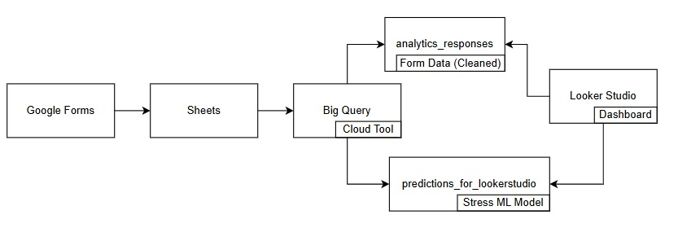

  

# Student Wellness Using Data Analytics

This project aims to **analyze and predict student wellness** levels using data-driven insights. By integrating **survey responses**, **machine learning predictions**, and **interactive dashboards**, it provides a comprehensive understanding of student stress, sleep quality, lifestyle habits, and overall well-being.

## Overview
Mental and physical wellness play a critical role in student performance and academic success.  
This project uses **data analytics and predictive modeling** to identify high-stress patterns and visualize key wellness factors such as:

- Stress Levels and Categories  
- Sleep Quality & Hours  
- Exercise and Diet Habits  
- Emotional Well-being & Social Support  
- Water Intake and Time Management

The results are visualized in an **interactive Looker Studio Dashboard** that supports data-driven decision-making for student wellness initiatives.

## Flow Charts
**AI Model**

**Application Flow** 

## Output
[View Dashboard PDF](./dashboard/Nexo.pdf)

## Key Features

**Data Cleaning and Transformation**  
- Parsed timestamps, normalized values, and validated survey responses.  
- Derived new columns like `sleep_quality_score`, `diet_quality_score`, and `overall_wellness_index`.

**Exploratory Data Analysis (EDA)**  
- Correlation analysis between lifestyle factors and stress scores.  
- Distribution and trend visualizations by gender, study year, and program.

**Machine Learning Predictions (BigQuery ML)**  
- Built classification models to predict **stress category** (`Low`, `Moderate`, `High`).  
- Used `ML.PREDICT` and probability-based predictions to evaluate model confidence.  
- Generated fields for **prediction confidence** and **is_correct** flag.

**Interactive Dashboards (Looker Studio)**  
- Dynamic filters by `Gender`, `Study Year`, `School`, and `Program`.  
- Visuals: Pie charts, heatmaps, line charts, and category comparisons.  
- Calculated fields for **Prediction %**, **Model Accuracy**, and **Stress Category Mapping**.

---

## Data Pipeline

| Step | Description |
|------|--------------|
| 1. Data Collection | Google Form responses automatically stored in Google Sheets |
| 2️. Data Cleaning | Imported and transformed using BigQuery |
| 3️. Data Modeling | Created analytical views and ML models in BigQuery |
| 4️. Visualization | Built interactive dashboard in Looker Studio |

---

## Dashboard Insights

* **Stress Distribution** by gender, study year, and program
* **High Stress %** calculated using Looker formulas
* **Accuracy Metrics** to validate prediction performance
* **Correlations** between sleep quality, diet, and stress

---

## Tech Stack

| Layer            | Technology                |
| ---------------- | ------------------------- |
| Data Storage     | Google Sheets / BigQuery  |
| Data Cleaning    | BigQuery SQL              |
| Machine Learning | BigQuery ML               |
| Visualization    | Looker Studio             |
| Automation       | Scheduled Queries         |

---

## How to Reproduce

1. Collect survey responses using Google Forms → Sheets.
2. Connect the sheet to BigQuery using Cloud Console.
3. Run SQL cleaning and transformation scripts.
4. Train your ML model using BigQuery ML.
5. Visualize results in Looker Studio with custom calculated fields.

---

## Future Enhancements

* Integrate **real-time stress detection** from wearables or mobile apps.
* Expand dataset across multiple institutions.
* Add **sentiment analysis** of open-text responses.
* Use **AutoML** for improved prediction accuracy.

---

## License

This project is released under the **MIT License**.
Feel free to use, modify, and enhance it for academic or research purposes.
